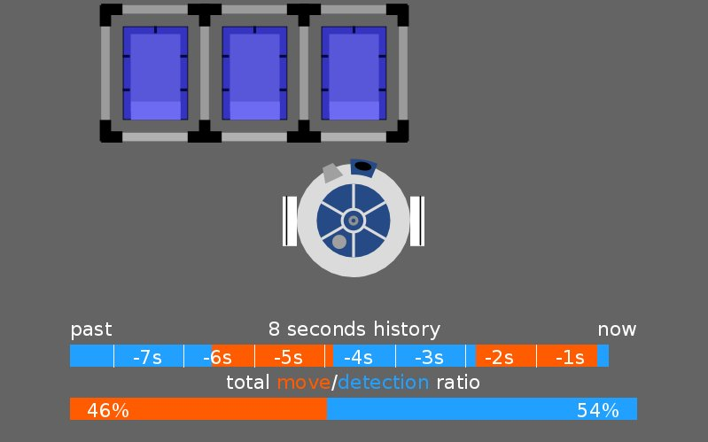

# Robot movement - detection ratio visualization

Free for any use.
I use this for a presentation to show the time duration of robot/human movement compared to the detection/actual information gain process time.
I know the code is a huge mess, but still better than blob.
Many parameters can be easier modified than some movie project files or whatever alternative I don't know.

